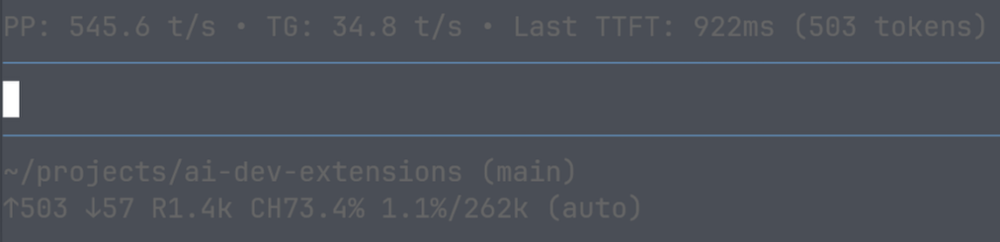

# tps-report

A [pi](https://github.com/earendil-works/pi-coding-agent) extension that shows a status widget above the editor with token throughput metrics: **PP** (prefill), **TG** (token generation), and **Last TTFT** (time to first token).


## Output

```
PP: 545.6 t/s • TG: 34.8 t/s • Last TTFT: 922ms (503 tokens)
```



## How the numbers are calculated

The model works in two phases, and **TTFT** (time to first token) is what we *assume* it can be used to split a message's total time into them:

```
|<----------- total (end - start) ----------->|
|<---- TTFT (prefill) ---->|<---- decode ---->|
start                  firstToken           end
```

- **PP** — prefill throughput: prompt tokens per second during the time *before* the first token. A rolling average over the last 16 messages.
- **TG** — token generation throughput: output tokens per second during the decode phase *after* the first token. A rolling average over the last 16 messages.
- **Last TTFT** — the raw time to first token of the most recent message (not averaged). The number in parentheses (e.g. `1523 tokens`) is that same message's input (prompt) token count, taken from the token usage reported when the message finished.

The input/output token counts come from the provider's reported usage (e.g. OpenAI's `CompletionUsage`): `prompt_tokens` for input (everything sent in the request: system prompt, history, tools, current message) and `completion_tokens` for output (tokens generated by the model). These are exact counts from the provider's tokenizer, not client-side estimates.

If the assumptions of the TTFT splitting the prefill and decode doesn't hold, or if the token usage returned from the API is inaccurate, then the data here will be inaccurate.
